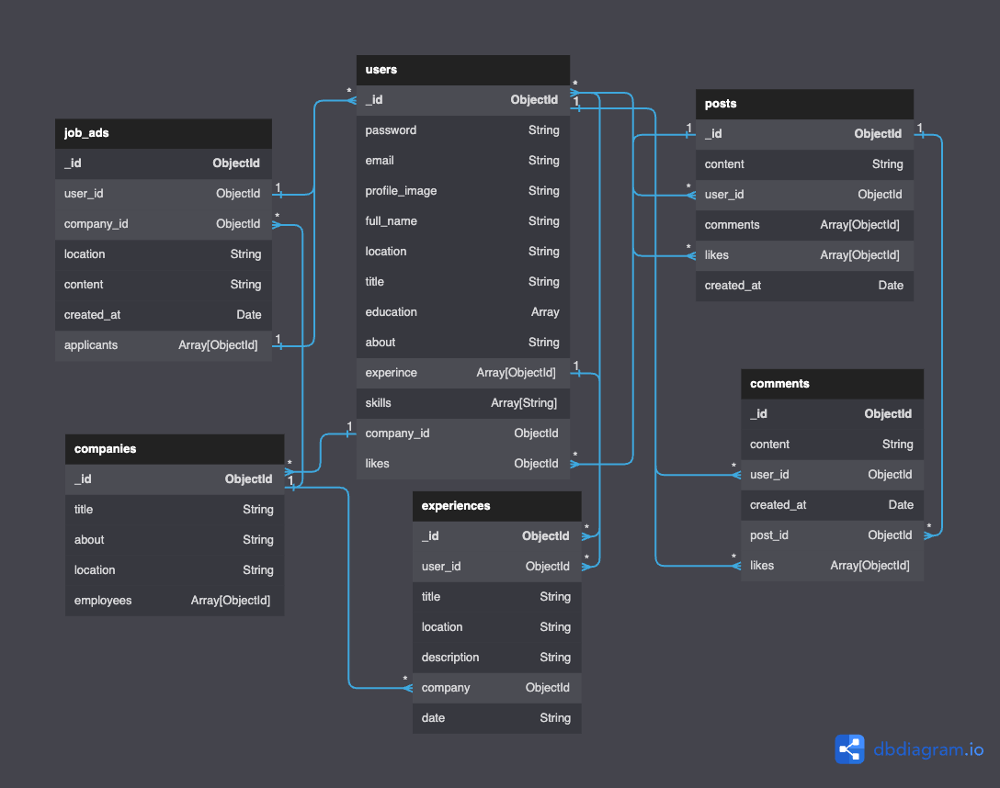

# [Click for live]()

# LinkedIn Clone

This project is still being developed

## Compiles and hot-reloads for development

### Getting Started

- Clone this repo
- Create MongoDb Cluster and Get Connection MongoDb URI
- Set environment variables in `config.env` under `./server/config`

  - Set `PORT = <PORT>`
  - Set `MONGO_URI = <YOUR_MONGO_URI>`
  - Set `JWT_SECRET_KEY = <YOUR_SECRET_KEY>`
  - Set `JWT_EXPIRE = 60m`
  - Set `JWT_COOKIE_EXPIRE = 60`

  #### Saltkey for CryptoJS

  - Set `_SALTKEY =  <YOUR_SALT_KEY>`

  #### Reset Password

  - Set `RESET_PASSWORD_EXPIRE = 36000000`

  #### NodeMailer

  - Set `SMTP_MAIL = <YOUR_GMAIL_EMAIL>`
  - Set `SMTP_PASSWORD = <YOUR_GMAIL_PASSWORD>`
  - Set `SMTP_PORT = 465`
  - Set `SMTP_HOST = smtp.gmail.com`

```bash
$ cd server
npm install
npm run start
$ cd client
npm install
npm run serve
```

## DB Diagram



### Technologies and Dependieces:

- Javascript
- HTML5
- CSS3
- Tailwind CSS


<div style="display: flex; flex-wrap: nowrap; justify-content: start; align-items: center;">
  <h2>Vue3 + Vite</h2>
  <a href="https://vitejs.dev/" target="_blank" rel="noreferrer">
    
  </a>
</div>


```bash
  "dependencies": {
    "axios": "^1.3.3",
    "moment": "^2.29.4",
    "vue": "^3.2.45",
    "vue-router": "^4.1.6",
    "vuex": "^4.1.0"
  },
  "devDependencies": {
    "@babel/plugin-proposal-optional-chaining": "^7.20.7",
    "@vitejs/plugin-vue": "^4.0.0",
    "autoprefixer": "^10.4.13",
    "postcss": "^8.4.21",
    "tailwindcss": "^3.2.6",
    "vite": "^4.1.0"
  }
```

## Nodejs

```bash
 "dependencies": {
    "body-parser": "^1.20.1",
    "cors": "^2.8.5",
    "crypto-js": "^4.1.1",
    "dotenv": "^16.0.3",
    "express": "^4.18.2",
    "express-async-handler": "^1.2.0",
    "jsonwebtoken": "^9.0.0",
    "mongoose": "^6.9.1",
    "multer": "^1.4.5-lts.1",
    "nodemailer": "^6.9.1",
    "slugify": "^1.6.5"
  },
  "devDependencies": {
    "nodemon": "^2.0.20"
  }
```

### Features

- Authorization
- Validation
- Routing
- Reactivity
- Alert Messages
- Login/Register
- Search By Searchkey
- Relationship
- Localstorage

### Customize configuration

See [Configuration Reference](https://cli.vuejs.org/config/).
